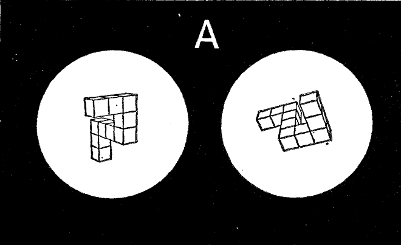

In this tutorial we are going to show how to implement a [mental rotation task](https://en.wikipedia.org//wiki/Mental_rotation) in [Psychopy](https://www.psychopy.org/).

## Background

The mental rotation task was originally developed by [Shepard and Metzler (1971)](https://www.science.org/doi/abs/10.1126/science.171.3972.701) and is still today one of the most commonly used task to investigate the cognitive manipulation of mental images. In the original study, participants were presented with 3D shapes.

In each trial, participants were presented with two shapes which could have been the same objects shown at different angles, or two different objects (one the mirrored version of the other). The task was to report whether the two shapes were the same or not. The hypothesis is that people need to mentally rotate one image in order to verify whether it matches the other or not. The higher the angle of rotation between the two images, the longer it should take to complete the task. Indeed, the authors observed a liner relationship between the participants' reaction times and the angle of rotation. 

## Building in Psychopy 

For this tutorial, we will implement a two dimensional version of the mental rotation task. The reason for this is that the three dimensional version would require us to create the images of the stimuli end then presenting them on the screen. Instead, a two dimensional version allows us to create the stimuli directly in Psychopy, giving us the opportunity to delve into this software a little bit more. In our version of the task we will use *letters* as stimuli. In each trial, two letters will be presented on the screen, one on the right side and one on the left side. The stimuli can be either the same letter rotated at a specific angle or the mirrored copy of each other, again rotated at a specific angle. In this way we obtain two main conditions:

1. *Same* condition: the two stimuli are the same letter and it is possible to verify this by rotating one stimulus so to match the other
2. *Mirrored* condition: the two stimuli, although represent the same letter, cannot be matched by a simple rotation. The only way to match them is by flipping one letter, which is not possible in this task.

The use of mirrored stimuli is necessary to present stimuli that are different while maintaining all the low level visual characteristic unchanged. At the end of the day, it would be way to easy to compare two completely different letters - say R and M - and report that they are different. The task will be to compare the letter on the right side of the screen, to the letter on the left side of the screen (target). For simplicity, we will use only one letter, the letter *R*. However, at the end of the tutorial we see how to use code snippets to present different letters. 

In the following sections we will start by creating two simple stimuli, then we will deal with rotating them and finally we will introduce all the different conditions (angles and whether the stimuli are mirrored or not). Although this experiment can be fully implemented through the Psychopy GUI, we will also add a few extra elements to introduce some simple code snippets in order to show the flexibility of Psychopy. 

Before we get started, let's have an overview of Psychopy. 

### Psychopy overview and preliminaries

When we open Psychopy we get three windows:

1. Builder (aka GUI - left)
2. Coder (where the Python code is compiled - center)
3. Runner (where some useful information is presented when the experiment is run - right)

For now we only need the *builder* window, so close the coder and the rummer windows. 

The builder section has three major areas: 
1. [Routines](https://www.psychopy.org/builder/routines.html): this is the central part of the window. Here you will see all the elements that will be presented at each step of the experiment
2. [Components](https://www.psychopy.org/builder/components.html): the panel on the right. Here you can find all the built in elements that you can use to create your experiment. Please take some time to look at them, oftentimes what you need for your study is already there
3. [Flow](https://www.psychopy.org/builder/flow.html): the panel at the bottom. Here you see, well, the flow of your experiment.

You can think of a study as being composed of different steps. For instance, an introduction, where you instruct the participant about what to do. A training section, where the participant complete some mock trials to get accustomed to the experiment. A test session, where the participant is presented with the real trials and you collect some data. Finally, a conclusions section, where you thank the participant and possibly debrief them. Each of this section. The way in which this section and their elements are presented is the *flow* of the experiment. If we zoom in into one section, let's say the test section, we could imagine this being composed by ba series of steps. For instance, each trial might start with a fixation cross. This might be followed by the presentation of a stimulus and by a interstimulus period with a randomized duration. Each of these elements could be implemented as their own routines (note that you could also implement all the elements in one *routine*, although sometimes this is a more difficult approach). Thus, you could see a routine as a section of the experiment with its own elements, aka *components* and its own parameters. Each experiment can be implemented in multiple ways, using a different number of components and routines. It might take some time and a few trials to find the best approach for a given experiment, so don't worry if you end up having to change your initial implementation. 

One last thing to mention, at the top of the builder window, you can see some icons. Some of these are very important, especially the one that looks like a monitor (*monitor settings and calibration*) and the one that looks like a gear (*Edit experiment settings*). We use these to tell Psychopy all the relevant information regarding the monitor where we present the experiment and the general settings of the experiment. Indeed, before we start even creating the experiment, it is good practice to ***specify the monitor we are using***. This means to specify the dimensions (width and height) of the screen and how far away the participant will sit from it. This is crucial as it influences how the stimuli are presented.

To define the monitor, click on the *monitor settings and calibration*. A new window will appear. We will focus only on the left side of this window. On the top part, under the *Choose monitor* section, click on new and enter a name for the monitor you want to use. This can be the brand of the monitor, or where the monitor is located, etc... I created two monitors here, one is my home monitor, for when I work at home, and one is my office monitor, for when I work in the office. Once you are happy with the name, click OK and make sure that the new monitor is now highlighted. If not, click on it. With the monitor name highlighted, we can now define the monitor specifications. In the bottom left half of the window, under *Monitor info*, we can define a few parameters:

1. Screen distance: how far away, in cm, you participant will be located from the screen (***PLEASE SET THIS TO 57 CM!***)
2. Size: resolution of the monitor in pixels
3. Screen width: width of the screen in centimeters 

Here you can see my parameters for my home monitor. 

Now we need to tell Psychopy to use this monitor, otherwise it will automatically default to the default one. To do this, click on *save* in the *Choose monitor* section of the monitor settings window and then close this. Now, click on the gear icon (*Edit experiment settings*) and go over the *Screen tab*. Here, at the very top there is a field called *Monitor*. Bu default it contains the name of Psychopy default monitor (*testMonitor*). Replace this with the name of the monitor you just created and click OK. If you use more than one screen, you will also need to set up the screen number with the screen you want to use. Just click on *Show screen numbers* and replace the value with the correct number. Now Psychopy should use your brand new defined monitor. (Note sometimes this is not the case. At the end of this tutorial I added a troubleshooting section where you can find how to verify is Psychopy is not using the defined monitor and how to overcome this problem).

We will see more settings later, but now let's get started with the experiment. 

### Presenting the target stimulus

In the *flow* section you can see that there is one "box" called *trial*. This box is a routine and Psychopy gives you one by default to work with. Later we are going to add more routines, but for the moment let's work on this. We said that we will use the letter ***R*** as a stimulus. To present a letter, we can add a *text* component to our routine. To do so, on the *component* panel on the right, click on the *Text* component under the *Stimuli* menu. This will open up a window like this, where you can define all the component parameters:

First of all, each component needs a unique name that identifies it. You define it in the *Name* section of the *Basic* tab. Here let's call this *target*. In the same tab we can also define when to start presenting the component and when to stop it. ***The duration is relative to the beginning of the routine. For instance, with this default paramters, the target will commence right at the beginning of the trial routine and will last for 1 second***. Defining the timing of a component is a vital aspect of a study and Psychopy offers different ways to do this. However, there are some technicalities that I don't want to discuss now (for instance, it might be better to define the timing in frames, as we do in the in-person bootcamp, but this might not be always the best solution). I leave this discussion to the end of this tutorial for those interested. For the moment, let's leave everything as it is. To define which letter to present, we need to modify the *Text* field. Everything you write in this field will appear on the screen. So let's write *R* here.

Amazing! Let's click OK and check what we have done! Before we run the experiment, we need to save it. SO save click on save (the floppy disk icon or Ctrl+S) ans save the file somewhere on your PC. Once you have done this, click on the *Green PLAY button* (Run the experiment). When you do so, a small window will appear asking the participant and session number. You can leave everything as it is for now. When you run a real esperiment, you will change this accordingly (eg. P01 for participant 1, etc...).

Once you press run, you should see this screen for about one second:

Ok, if everything is working fine, we can now change some more setting. We would like to present the target on the left side of the screen and we might also want to increase the size of the letter. Let's do this. Back in the *builder* window, click on the *target* component to open its settings. Before we used only the *Basic* tab, but more tabs are available. Click on the *Layout* tab. Here we can define the position, orientation and other elements important for a text component (note that a text component can be used to present entire sentences or paragraphs). As said above, we want to present the target opn the left side of the screen. To do this, we need to modify the *Position [x,y]* field under the *Layout* tab. Here we need to pass two values as a [touple](https://www.geeksforgeeks.org/python-tuples/). These values are the X and Y coordinates of the screen where we want to center our stimulus. Right, but how can we know the values of these coordinates? To understand this we need to digress a bit into the world of Psychopy coordinate system. 

### Digression on Psychopy coordinate system

Psyhcopy treat your screen as a Cartesian plane, or as a battleship grid if you want. The size of the grid depends on your screen - know you know why we defined the screen before starting with our experiment. Now, the origin of this grid, the (0,0) point, is the center of the screen. You can see that the *R* in our first test has been presented in the middle of the screen. Indeed, if you look at the default value in the *Position [x,y]* field of the text component you will see *(0,0)*. Having said this, we know need to focus on which units is the size of the grid is expressed. You might think *pixels* as this is the way we defined the screen size. But you'll be wrong. Psyhcopy defualt unit of measure is ***height***. You can see this if you open the *settings* and go in the *Screen* tab. Here you see a field called *Units* with the value set to *height*.

You can find an explanation of the height and all other possible units [here](https://psychopy.org/general/units.html). If you read there, you will see that the *height* is a pretty weird unit system which depends on the window size where the experiment is presented. You might think that the best unit to use is *pixels*, as this is how we define a monitor size and they are easy to understand. However, defining our parameters in terms of pixels means that the size of our stimuli and their location will change depending on the specific screen we use. What if someone else wants to use our script to replicate our experiment? Or maybe you need to test using different PCs/screens. To avoid these problems, we are going to use the *degree* unit. This unit specifies location and sizes in terms of *degree of visual angle*. In simple terms, the degree of visual angle reflect the angle an object subtend to the retina (see [here](https://osdoc.cogsci.nl/3.3/visualangle/) and [here](https://en.wikipedia.org/wiki/Visual_angle) for more details). The crucial element with the degree of visual angle is that its value depends on the distance of the object from the eye. Do you remember that we set the viewing distance for our monitor. 

I have asked you to set the viewing distance to 57cm. The reason for this is that at this distance, one degree of visual angle corresponds to roughly 1cm. Thus, when we set the sizes, we can think in terms of centimeters. Using the *degrees of visual angle* is excellent as we can ensure that the stimuli will be perceived in the same relative position and size even if we change monitors. If you read some literature on visual perception, you will notice that the majority of authors report their stimuli dimensions in degrees. This is the reason why. 

Amazing, so let set the default units to degrees by selecting *deg* in the *Units* field of the *Settings* window (see picture above). In doing so, all units will be now expressed in *degrees of visual angle* by default. 

### Back to the target stimulus

Fantastic! With the units covered and properly set, let's open the *target* component window again and let's go to the *Layout* tab. Before the digression we were modifying the *Position [x,y]* of the target. If the digression is clear, to present the target on the left side of the screen, we need to pass a negative value to the X coordinate (hint: the center of the screen is (0,0). Positive values are right and up, negative values are left and down). As we are using *deg* as units, we approximate them as centimeters, so let's say we will present the target around 8 degrees (8 cm) on the left. We pass the value (-8, 0). We leave the Y coordinate as 0, as we want the letter midway on the vertical axis. Press OK, save and then run the experiment again.

