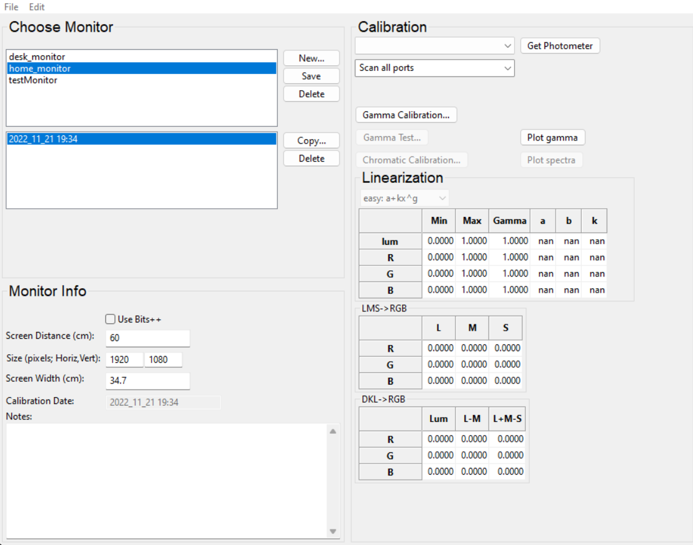

In this tutorial we are going to show how to implement a [mental rotation task](https://en.wikipedia.org//wiki/Mental_rotation) in [Psychopy](https://www.psychopy.org/).

## Background

The mental rotation task was originally developed by [Shepard and Metzler (1971)](https://www.science.org/doi/abs/10.1126/science.171.3972.701) and is still today one of the most commonly used task to investigate the cognitive manipulation of mental images. In the original study, participants were presented with 3D shapes.

In each trial, participants were presented with two shapes which could have been the same objects shown at different angles, or two different objects (one the mirrored version of the other). The task was to report whether the two shapes were the same or not. The hypothesis is that people need to mentally rotate one image in order to verify whether it matches the other or not. The higher the angle of rotation between the two images, the longer it should take to complete the task. Indeed, the authors observed a liner relationship between the participants' reaction times and the angle of rotation. 

## Building in Psychopy 

For this tutorial, we will implement a two dimensional version of the mental rotation task. The reason for this is that the three dimensional version would require us to create the images of the stimuli end then presenting them on the screen. Instead, a two dimensional version allows us to create the stimuli directly in Psychopy, giving us the opportunity to delve into this software a little bit more. In our version of the task we will use *letters* as stimuli. In each trial, two letters will be presented on the screen, one on the right side and one on the left side. The stimuli can be either the same letter rotated at a specific angle or the mirrored copy of each other, again rotated at a specific angle. In this way we obtain two main conditions:

1. *Same* condition: the two stimuli are the same letter and it is possible to verify this by rotating one stimulus so to match the other
2. *Mirrored* condition: the two stimuli, although represent the same letter, cannot be matched by a simple rotation. The only way to match them is by flipping one letter, which is not possible in this task.

The use of mirrored stimuli is necessary to present stimuli that are different while maintaining all the low level visual characteristic unchanged. At the end of the day, it would be way to easy to compare two completely different letters - say R and M - and report that they are different. The task will be to compare the letter on the right side of the screen, to the letter on the left side of the screen (target). For simplicity, we will use only one letter, the letter *R*. However, at the end of the tutorial we see how to use code snippets to present different letters. 

In the following sections we will start by creating two simple stimuli, then we will deal with rotating them and finally we will introduce all the different conditions (angles and whether the stimuli are mirrored or not). Although this experiment can be fully implemented through the Psychopy GUI, we will also add a few extra elements to introduce some simple code snippets in order to show the flexibility of Psychopy. 

Before we get started, let's have an overview of Psychopy. 

### Psychopy overview and preliminaries

When we open Psychopy we get three windows:

1. Builder (aka GUI - left)
2. Coder (where the Python code is compiled - center)
3. Runner (where some useful information is presented when the experiment is run - right)

For now we only need the *builder* window, so close the coder and the rummer windows. 

The builder section has three major areas: 
1. [Routines](https://www.psychopy.org/builder/routines.html): this is the central part of the window. Here you will see all the elements that will be presented at each step of the experiment
2. [Components](https://www.psychopy.org/builder/components.html): the panel on the right. Here you can find all the built in elements that you can use to create your experiment. Please take some time to look at them, oftentimes what you need for your study is already there
3. [Flow](https://www.psychopy.org/builder/flow.html): the panel at the bottom. Here you see, well, the flow of your experiment.

You can think of a study as being composed of different steps. For instance, an introduction, where you instruct the participant about what to do. A training section, where the participant complete some mock trials to get accustomed to the experiment. A test session, where the participant is presented with the real trials and you collect some data. Finally, a conclusions section, where you thank the participant and possibly debrief them. Each of this section. The way in which this section and their elements are presented is the *flow* of the experiment. If we zoom in into one section, let's say the test section, we could imagine this being composed by ba series of steps. For instance, each trial might start with a fixation cross. This might be followed by the presentation of a stimulus and by a interstimulus period with a randomized duration. Each of these elements could be implemented as their own routines (note that you could also implement all the elements in one *routine*, although sometimes this is a more difficult approach). Thus, you could see a routine as a section of the experiment with its own elements, aka *components* and its own parameters. Each experiment can be implemented in multiple ways, using a different number of components and routines. It might take some time and a few trials to find the best approach for a given experiment, so don't worry if you end up having to change your initial implementation. 

One last thing to mention, at the top of the builder window, you can see some icons. Some of these are very important, especially the one that looks like a monitor (*monitor settings and calibration*) and the one that looks like a gear (*Edit experiment settings*). We use these to tell Psychopy all the relevant information regarding the monitor where we present the experiment and the general settings of the experiment. Indeed, before we start even creating the experiment, it is good practice to ***specify the monitor we are using***. This means to specify the dimensions (width and height) of the screen and how far away the participant will sit from it. This is crucial as it influences how the stimuli are presented.

To define the monitor, click on the *monitor settings and calibration*. A new window will appear. We will focus only on the left side of this window. On the top part, under the *Choose monitor* section, click on new and enter a name for the monitor you want to use. This can be the brand of the monitor, or where the monitor is located, etc... I created two monitors here, one is my home monitor, for when I work at home, and one is my office monitor, for when I work in the office. Once you are happy with the name, click OK and make sure that the new monitor is now highlighted. If not, click on it. With the monitor name highlighted, we can now define the monitor specifications. In the bottom left half of the window, under *Monitor info*, we can define a few parameters:

1. Screen distance: how far away, in cm, you participant will be located from the screen (***PLEASE SET THIS TO 57 CM!***)
2. Size: resolution of the monitor in pixels
3. Screen width: width of the screen in centimeters 

Here you can see my parameters for my home monitor. 

Now we need to tell Psychopy to use this monitor, otherwise it will automatically default to the default one. To do this, click on *save* in the *Choose monitor* section of the monitor settings window and then close this. Now, click on the gear icon (*Edit experiment settings*) and go over the *Screen tab*. Here, at the very top there is a field called *Monitor*. Bu default it contains the name of Psychopy default monitor (*testMonitor*). Replace this with the name of the monitor you just created and click OK. If you use more than one screen, you will also need to set up the screen number with the screen you want to use. Just click on *Show screen numbers* and replace the value with the correct number. Now Psychopy should use your brand new defined monitor. (Note sometimes this is not the case. At the end of this tutorial I added a troubleshooting section where you can find how to verify is Psychopy is not using the defined monitor and how to overcome this problem).

We will see more settings later, but now let's get started with the experiment. 

### Presenting the target stimulus

In the *flow* section you can see that there is one "box" called *trial*. This box is a routine and Psychopy gives you one by default to work with. Later we are going to add more routines, but for the moment let's work on this. We said that we will use the letter ***R*** as a stimulus. To present a letter, we can add a *text* component to our routine. To do so, on the *component* panel on the right, click on the *Text* component under the *Stimuli* menu. This will open up a window like this, where you can define all the component parameters:

First of all, each component needs a unique name that identifies it. You define it in the *Name* section of the *Basic* tab. Here let's call this *target*. In the same tab we can also define when to start presenting the component and when to stop it. ***The duration is relative to the beginning of the routine. For instance, with this default paramters, the target will commence right at the beginning of the trial routine and will last for 1 second***. Defining the timing of a component is a vital aspect of a study and Psychopy offers different ways to do this. However, there are some technicalities that I don't want to discuss now (for instance, it might be better to define the timing in frames, as we do in the in-person bootcamp, but this might not be always the best solution). I leave this discussion to the end of this tutorial for those interested. For the moment, let's leave everything as it is. To define which letter to present, we need to modify the *Text* field. Everything you write in this field will appear on the screen. So let's write *R* here.

Amazing! Let's click OK and check what we have done! Before we run the experiment, we need to save it. SO save click on save (the floppy disk icon or Ctrl+S) ans save the file somewhere on your PC. Once you have done this, click on the *Green PLAY button* (Run the experiment). When you do so, a small window will appear asking the participant and session number. You can leave everything as it is for now. When you run a real esperiment, you will change this accordingly (eg. P01 for participant 1, etc...).

Once you press run, you should see this screen for about one second:

Ok, if everything is working fine, we can now change some more setting. We would like to present the target on the left side of the screen and we might also want to increase the size of the letter. Let's do this. Back in the *builder* window, click on the *target* component to open its settings. Before we used only the *Basic* tab, but more tabs are available. Click on the *Layout* tab. Here we can define the position, orientation and other elements important for a text component (note that a text component can be used to present entire sentences or paragraphs). As said above, we want to present the target opn the left side of the screen. To do this, we need to modify the *Position [x,y]* field under the *Layout* tab. Here we need to pass two values as a [touple](https://www.geeksforgeeks.org/python-tuples/). These values are the X and Y coordinates of the screen where we want to center our stimulus. Right, but how can we know the values of these coordinates? To understand this we need to digress a bit into the world of Psychopy coordinate system. 

### Digression on Psychopy coordinate system

Psyhcopy treat your screen as a Cartesian plane, or as a battleship grid if you want. The size of the grid depends on your screen - know you know why we defined the screen before starting with our experiment. Now, the origin of this grid, the (0,0) point, is the center of the screen. You can see that the *R* in our first test has been presented in the middle of the screen. Indeed, if you look at the default value in the *Position [x,y]* field of the text component you will see *(0,0)*. Having said this, we know need to focus on which units is the size of the grid is expressed. You might think *pixels* as this is the way we defined the screen size. But you'll be wrong. Psyhcopy defualt unit of measure is ***height***. You can see this if you open the *settings* and go in the *Screen* tab. Here you see a field called *Units* with the value set to *height*.

You can find an explanation of the height and all other possible units [here](https://psychopy.org/general/units.html). If you read there, you will see that the *height* is a pretty weird unit system which depends on the window size where the experiment is presented. You might think that the best unit to use is *pixels*, as this is how we define a monitor size and they are easy to understand. However, defining our parameters in terms of pixels means that the size of our stimuli and their location will change depending on the specific screen we use. What if someone else wants to use our script to replicate our experiment? Or maybe you need to test using different PCs/screens. To avoid these problems, we are going to use the *degree* unit. This unit specifies location and sizes in terms of *degree of visual angle*. In simple terms, the degree of visual angle reflect the angle an object subtend to the retina (see [here](https://osdoc.cogsci.nl/3.3/visualangle/) and [here](https://en.wikipedia.org/wiki/Visual_angle) for more details). The crucial element with the degree of visual angle is that its value depends on the distance of the object from the eye. Do you remember that we set the viewing distance for our monitor. 

I have asked you to set the viewing distance to 57cm. The reason for this is that at this distance, one degree of visual angle corresponds to roughly 1cm. Thus, when we set the sizes, we can think in terms of centimeters. Using the *degrees of visual angle* is excellent as we can ensure that the stimuli will be perceived in the same relative position and size even if we change monitors. If you read some literature on visual perception, you will notice that the majority of authors report their stimuli dimensions in degrees. This is the reason why. 

Amazing, so let set the default units to degrees by selecting *deg* in the *Units* field of the *Settings* window (see picture above). In doing so, all units will be now expressed in *degrees of visual angle* by default. 

### Back to the target stimulus

Fantastic! With the units covered and properly set, let's open the *target* component window again and let's go to the *Layout* tab. Before the digression we were modifying the *Position [x,y]* of the target. If the digression is clear, to present the target on the left side of the screen, we need to pass a negative value to the X coordinate (hint: the center of the screen is (0,0). Positive values are right and up, negative values are left and down). As we are using *deg* as units, we approximate them as centimeters, so let's say we will present the target around 15 degrees (15 cm) on the left. We pass the value (-15, 0). We leave the Y coordinate as 0, as we want the letter midway on the vertical axis. Press OK, save and then run the experiment again.

Uhm...it is possible that the R is now disappeared on the screen or it might look quite small, just a few pixels maybe. Can you think why this is the case? The culprit are the units of measure. As we have changed the default units to degrees, now everything is expressed in the same way, even the font size. Thus, we need to change this. Head back to the target component and click on the *Formatting* tab. Here you can see a field called *Letter height*. By default its value is set to 0.05. Let's change this to 3 (aka 3 degrees). 

Press OK and run the experiment. Now everything should look how we want it. 

Note that for some parameters of the majority of the components you can override the default units. To do this, look for a field called *Spatial Units* or similar. By default this is set to *from exp settings*, but you can change it if you'd like. However, note that doing this might create problems when you are working with multiple components and routines. It is easier to use the same units everywhere. 

### Adding the second stimulus

We now want to add a second stimulus on the right side of the screen. There are two ways to do this. One is by following the same procedure above. Add a new text component to the *trial* routine, give it a name, set its value (*R* again) and set its parameters. However, we can also use a short cut. As we basically want to replicate the same stimulus as the target, why not copy-and-paste that? Psychopy allows us to do so. 

Right-click on the target component. A menu should appear and the first entry is *copy(name_of_component)*. Click on *copy*. To paste, you can do a few things:

1. Right-click on a empty space of the window and select *paste(name_of_component)*
2. Click on *Experiment* on the top menu and select *Paste Component*
3. Press Ctrl+Alt+V

Either way, Psychopy will ask you to provide a new name for the new component. Remember that each component must have a unique name! Let's call this *letter*. 

This will be added underneath the target component.  

***Note that the order of the components is important! Psychopy will draw components in the same order as they appear on the your builder screen. Thus, here, it will draw the target first and then the letter. This is not really relevant at the moment but it could be critical in other settings. For instance, if we would like to show one image on top of the other, we need to set the background image as the first (top) component and the foreground as the second (bottom) component.***

At the moment the letter component is exactly the same as the target component. So, let's open the letter component properties (left-click on in) and in the *Layout* tab change the *Position [x,y]* from (-15,0) to (15,0). This way the two letters will be presented symmetrically on the two side of the screen. If you press OK and run the experiment, you should see this:

Just that we are here, why don't we change the rotation of the angle of the letter component? We can do this simply by opening that component properties, going into the *Layout* tab and modifying the *Orientation* field. This is always expressed in degrees, form 0 to 360. As a test, let's put the letter component upside down by setting its *Orientation* to 180. The result should be this:

This looks nice. However, how can we programmatically change the rotations for each trial? How do we even create multiple trials? We cover this in the next section. 

### Trails and Conditions

In this experiment we want to manipulate both the target stimulus and the other letter orientation for each trial. One naive way to do this, is to create multiple routines, each one containing the two stimuli with different orientations. 

This approach would work, but it has a few shortcomings:

1. It does not allow for randomization: each participant will be shown the same trials in the same order
2. It makes maintenance of the experiment and troubleshooting hard: if you need to change one parameter in each trial, you would need to manually go over each routine and modify it. 

A better approach is to use a *loop* to reiterate the same trial routine over and over while modifying the stimuli parameters at each iterations. To insert a loop, we can just click on *Insert Loop* in the *Flow* panel. Once you do this, you will see a dot appearing on the flow line, next to your *trial* routine. If you move your mouse, you will see the dot moving too. What we need to do is to over the dot where we want the loop to begin and click there. Then, we move the mouse again and we click where we want to loop to end. Loops will always start and end before and after the routines, never in the middle. That is, you can only loop over entire routines (or series of routines). Note, if you have only one routine in the flow, then you do not need to click a second time, Psychopy automatically sets the loop to end after the routine itself. 

After we have selected the starting and ending point of the loop, a new tab will appear. A loop is like a component, so it will need a name - here *loop_trials* - and it has its own properties. The most important are:

1. *loopType*: this controls the randomization of your trials. Leave this as *random* but you can read more about the other options [here](https://www.psychopy.org/builder/flow.html#loop-types)
2. *nReps*: how many times you want to loop over your trials. Note, this is not the number of trials but the number of repetitions of all the trials! For instance, if we define 100 trials and we leave this value to 5, then we will present 500 trials (5 times 100 trials).
3. *Conditions*: here we should pass the filename of a file containing all the trials specs we want to run. We will create this soon. 

For the moment, set the *nReps* to 1, press OK and save. We need to talk about filepath. 

### Digression on file organization 

We need to briefly talk about how to organise files in Psychopy. To do this, head over the folder where you have saved your experiment. Here you should see three files:

1. *your_exp_name.psyexp*: this is the builder file, the one we are working on with the GUI
2.  *your_exp_name_lastrun.py*: this is a Python file automatically created by Psychopy every time you run an experiment
3. *data* folder: this folder is created by Psychopy to store the data related to each experimental session. Every time you run an experiment, 3 new files are added to this folder. As we have run the experiment a few times to test it, this folders should contain a few files. For each session, the three files have the same name but different extensions. The name, as of now, starts with the participant id number, is followed by the experiment name and ends with the date and time when the session was run. Of these three files, the most important is the *csv* file, as it contains all the data necessary for the analysis of an experiment. For instance, the time at which each component started and ended, response times of the participants, whether a response was correct or not, etc... More information is provided [here](https://psychopy-hoechenberger.readthedocs.io/en/latest/general/dataOutputs.html)

The folder containing these files is your main directory and it is included in the search path of your experiment. That is, every file included here can be called within the Psychopy experiment if necessary. For instance, if you would like to present some images (hint: use the image component), you want to put them in this folder, maybe in a subfolder called *images*. 

In our case, we want to create a file containing the details of the conditions of each trial. What I like to do for my experiments, is to create a subfolder in my main experiment directory called *conditions*, there, I store the file/s I need to tell Psychopy how to run each trial.

### Condition file

Sweet, but how we create a condition file? This is pretty simple, open *OpenOffice Calc* or *Excel* (if you don't want to use an opensource software). We will use this spreadsheet to define the trials parameters. Note:

1. Each row will define a different trial
2. Each column will define a different parameter
3. This data will be also reported in the output file

This might seem tricky, but once we have created some trials it should look straightforward (although more complex experiments might have complex condition files too). 

The first thing we want is to keep track of which condition each trial is member. In our case, we have two main conditions, namely, *same* and *mirrored*, depending on whether the two stimuli are the same or are the mirrored version of each other. Thus, we name the first column *condition*. Secondly, we want to change the angle of rotation of the target letter, so to not present it straight up all the time. We call the second column *target_angle*. We also want to be able to define the angle of rotation of the second stimulus, so we call the third column *letter_angle*. The spreadsheet should look like this:

***Note that the parameter names must always go in the first line of the coloum and they cannot contain space***. For this experiment, we want to present the target letter at five possible angles, 0, 60, 120, 180, 240 degrees. So we add these, values each one on a new line of the spreadsheet, in the *target_angle* column. 

Now we need to think of the angle of the second stimulus. We want to present the second stimulus rotated at the same five angles as the target. However, we want to cover all the scenarios, so that every combinations of angle is covered. For instance:

| Target_angle | Letter_angle|
| --- | --- |
| 0 | 0 |
| 60 | 0 |
| 120 | 0 |
| 180 | 0 |
| 240 | 0 | 
| 0 | 60 |
| 60 | 60 |
| 120 | 60 | 
| 180 | 60 |
| 240 | 60 |
| 0 | 120 |
| 60 | 120 |
| ... | ... |

So now we need to create this. Let's start by creating the conditions where the second stimulus is presented with a rotation of 0 degrees.

Then, we can past and copy these lines, and modify the *letter_angle* so to cover all the combinations (0, 60, 120, 180, 240)

Here we have defined 25 different trials, each with a different combination of angles of rotation. 

For the condition, let's start with the *same* condition. Here, we can simply add the label *same* in each row of the 25 trials, under the *condition* column.

At the moment, the *condition* column contains only a label to remind ourselves which condition these trials belong to. We still need to specify that the two stimuli must be the same, that is they should not be mirrored (flipped). So, let's add a new column and let's call it *flip*. As the stimuli here should not be flip, we provide a value of 0 to every trial. Do not worry about this value now,  we will use it later. 

Ok, so we have defined the trials for the *same* condition. Now we need to define the trials for the *mirrored* condition. The only difference between the two will be the *flip*; thus we can copy and paste our trials to add 25 new trials. We will change the *condition* label to *mirrored* to remind ourselves that these trials are part of a different condition.

Then, we need to modify the flip value for these trials. Here we are going to use the value *horiz* as it is a keyword that Psychopy understands when dealing with flipping a stimulus. We will see why later. 

Fantastic! we can now save this file as a ***csv*** file in the experiment directory. Try to always use the csv format!

### Using the condition file in Psychopy

With our condition file saved in the experiment directory, we can go back to Psychopy builder. The last thing we did was to add a loop to our *trial* routine. Now, we need to load in Psychopy the condition file so that we can use it. The condition file is loaded by opening the loop properties (click on the loop name) and clicking on the folder icon next to the *Conditions* field. By doing this, you can navigate to your condition file and select it and click *Open*.

If everything is correct, you should see the following sentence underneath the *Condition* field: *50 condition, with 4 parameters [condition, target_angle, letter_angle, flip]*. Press OK. 

What this does is to load the file and make the parameters available to Psychopy. That is, we can use the parameter names as variables to define the settings of our components. In our case, we have four parameters, so we can use these four variables as needed. Let's see how. 

To begin with, we want to modify the angle at which the target and the other letter are presented, at each trial. To do this, we open the target *Properties* window and we go to the *Layout* tab. At the moment the orientation is set to 0. However, as you can see, next the the *Orientation* field there is a ***$*** sign. This symbol is used by Psychopy to indicate that a variable can be used instead of a fixed value. Whenever you see this symbol, you can pass a variable, as long as it has been defined somewhere - in our case in the condition file. The variable/parameter containing the angle values for the target was called *targte_angle* in the condition file, so we pass this name here. Then, we also need to tell Psychopy that this variable needs to take up a different value (update) every trial. To do this, click on the menu saying *constant* next to the *Orientation* field. Here you will find three options:

1. *Constant* (default): the value of this parameter is fixed throughout the experiment
2. *Set every repeat*: change the parameter value every time the routine is run
3. *Set every frame*: change this value every screen refresh. If your screen has a refresh rate of 60Hz, then the value of the parameter will be updated 60 times per second.

Here we want to modify the rotation for each trial, so we set this value to *Set every repeat*. Now, when we run the experiment Psychopy is going to load the condition file and it will read the values in it. Because we have a loop around the trial routine, it will repeat this routine as many times as the number of trials (rows) defined in the condition file (assuming that the *nRep* parameter of the loop is set to 1, otherwise it will repeat the routine nRep x n_trials). For each trial (repetition of the routine), Psychopy will use the values defined in one of the lines of the condition file to set the parameters we have defined. In this case, it will use the values in the *target_angle* column to set the *Orientation* of the target letter in each trial.

How are the values selected from the condition file? Well, as we defined the *loopType* field of the loop as *random*, then Psychopy will read the lines randomly, without repetitions. In other words, in our case it will present the 50 trials in random order. 

***If you run the experiment now, you should see the target letter changing angle after every second.***

Amazing, let's now set all the other parameters. Firstly, we want to set the angle of the other letter to update each trial as well. To accomplish this we can simply repeat what we did above. Open the letter properties, set the *Orientation* field to *letter_angle* (the parameter name used in the condition file), and set this filed to update every repetition (*Set every repeat*). We also need to define whether the two letters are the same or one the mirrored version of the other. To do this, we can work on the *Flip* field of the letter component - this is just underneath the *Orientation* field. At the moment this is set to *None*. You might also notice that this filed does not have a ***$*** symbol next to it. So, to pass the value we have defined in the *flip* column of the condition file, we need to write *$flip*. This tells Psychopy to use a variable called *flip* defined in the condition file. You might also remember that for th *same* condition, this value is was set to 0, while for the *mirrored* condition was set to *horiz*. The reason why we did this, is that you can use the keyword *horiz* here to flip a text component, well, horizontally. Note, if you over you mouse on this field, you will see all the possible values you can pass to this field. Again, as we want this value to change for every trial, we set it to update every repeat through the menu next to it. 

Great, now our experiment should run 50 trials, 25 of them of the *same* condition and 25 of the *mirrored* condition. Try to run the experiment. You should see the letters changing angles every second. If you pay attention, you should also notice that some letters are flipped (you cannot match them by simply rotating them). So the bulk of the experiment is almost ready. Now we need a way to record the answer of the participant. 

### Collecting answers

The task of this study is to report whether the two letters presented at any given time are same or not (mirrored version of each other). As an example, we will ask the participant to press the letter **A** if the letter on the right is the same as the one on the left. If not, the participant should press the letter **L**. Let's begin by defining these settings in the condition file. Open the csv file we created before and add one column that we will call *expected_key*. As we said, when one of the *same* trial is presented, we will expect the *A* key to be pressed. Thus, we write *a* in the *expected_key* column for all the *same* trials. Conversely, when a *mirrored* trial is run, we expect the letter *L* to be pressed. Thus, we will add *l* in the *expected_key* column for those trials.The condition file should look like this:

Focus on the last column. 
Great, we have defined the keys we expect for each trial, now we need to add a way for Psychopy to record key presses. Go back to the builder window. Here we need to add a *keyboard* component to the trial routine. In the *Components* panel, under the *Responses* menu, you will see a *Keyboard* component. Click on it to add it to the routine. As we did for the stimuli components, we need to provide a unique name to this component. I'll call it *part_response*. We want the component to last as long as the visual stimuli, so we set it to start at time 0.0 (default) and we set the *Stop* time to 1.0 (seconds). 

Now we need to set fields specific to the keyboard component. Firstly, you see a thick box called *Force end of Routine*. When this is checked (default), a valid key press will end the trial (routine) and the next trial will commence. If we are at the last trial, the next routine in the flow will start or the experiment will end. We want this behaviour, so let's leave this checked. Beneath this, you see an *Allowed keys* field. Here we define which keys Psychopy will look for. If you press a key not contained in this list nothing will happen - except for the *Esc* key, which will always terminate the experiment whenever pressed. In our experiment, we want participants to prss either *a* or *l*, so we write these keys. Note that each key needs to be reported with straight quotes ('') and they need to be separated by a comma. 

These settings will allow Psychopy to record keyboard responses. However,  we also need a way to record whether the responses were correct - the participant pressed the expected key - or not. Although we could figure this out by comparing the expected key with the pressed key using the output file, Psychopy allows us to automatically verify this and store this information in the output csv file. If you go on the *Data* tab of the keyboard properties window, you'll see a *Store correct* field. Check this and the *Correct answer* field will be unlocked. The *Correct answer* is the field where we tell Psychopy what is the answer we expect. We have defined this answer in the condition file, so guess what we need to pass here? Yup, the name of the column containing the correct answer preceded by a ***$*** symbol. Thus, let's write *$expected_key*. Basically we are telling Psychopy that the correct answer for the current trial is the one that can be found in the condition file in the defined column. 

Leave the other parameters as they are. But if you are curious, check [here](https://www.psychopy.org/builder/components/keyboard.html)

### Fine tuning

Before we run a test, let's fine tune the experiment and add a fixation cross. First of all, we would like to have the trials to last a bit longer (this is not an easy task). Let's say that a trial will last until a response is provided or for a maximum of 5 seconds. To do this, we just need to change the *Stop* field of each of the three components, from 1 second to 5 seconds. Because the keyboard has the option *Force end of Routine* selected, the trial will end if the *a* or *l* keys are pressed within the 5 seconds. 

Now we want to add a fixation cross in the middle of the screen. Psychopy offers a handy component to do this. Under the *Stimuli* menu of the *Components* panel, you will find a *Polygon* component. Click on it to add it to the routine. As always we give it a name (*fixation_cross*), we set the start and stop times as the other components (0 sec to 5 sec). Now, we set the *Shape* field to *cross*. We also need to change the set the size, position and colour of the cross. Go to the *Layout* tab and modify the *Size [w,h]* filed by passing a [touple](https://www.geeksforgeeks.org/python-tuples/) with the width and height of the cross. Remember, we are working with *degrees of angle*! Here I set the cross to subtend 1.5 degrees of angle (around 1.5 cm) by passing *(1.5, 1.5)*. We will leave the position as *(0,0)* as the that is the origin of the screen in the Psychopy coordinate system. Finally, click on the *Appearance* tab and change the *Fill Color* and *Border Color* from *white* to *red*.

Please, play around with all the other fields to learn what they do and what you can achieve. You can also read some more [here](https://www.psychopy.org/builder/components/polygon.html). Now, if you run the experiment you will see that something like this:

Each trial will change after 5 seconds if you do not press any key. However, if you press the *a* or *l* keys, then the current trial will end and the next trial will start. The whole experiment should have 50 trials, each presented once. Try to press other keys as well. What happens? If everything is set up correctly, nothing. 

### Adding some instructions

Before we look at the output file, let's make this experiment a bit more user friendly and complete. Let's add some instructions before the trials start. This will give us the opportunity to add a new routine and review the loops. 

In the builder window, let's add a new routine by pressing *Insert Routine* in the *flow* panel. Click on *(new)* and then name the routine *instructions*. 

Press OK and you will see that a dot appears on the *flow* arrow. As for the loop, you use your mouse to select where in the flow you would like to add the new routine. Here we click before the trial routine, ***outside the loop!***. Think about what would happen if you add the new routine inside the loop. 

At the moment, this is a empty routine. We need to populate it with some instructions. The following is my personal approach, but other possibilities exist. As you will see, I exploit the loops to present different text slides without having to create multiple components. Let's see how it is done. 

Firstly, we need to create a brand new condition csv file. Open *OpenOffice Calc* or *Excel* and create a new spreadsheet. Here we need only one parameter and we will call it *intro_text*. The idea here is to present the instructions as self-paced trials, so to have the text nicely spread and not crowded into one single slide. Thus, we will divide the instructions into different rows of our new spreadsheet. For instance, here we will have four rows containing the following text:

| row | text |
| --- | --- |
| 1 | Welcome to this experiment and thank you for deciding to participate! |
| 2 | In this study you will see two letters presented one on the left and the other on the right side of the screen. Your job is to decide whether they are the same letters or not |
| 3 | To do this you need to mentally rotate the letter on the left to try to match the one on the right. Sometimes the letters are a mirrored version of each other and they cannot be matched with a simple rotation |
| 4 | If the letters match (are the same) press the A key. If they do not match (mirrored) press the L key. |

Save this file in the same directory as the condition file. Now head back to the builder window and add a loop around the instructions routine. Called this *loop_intro*, set the *nReps* parameter to 1 and, most importantly, ***set the loopType paramter to sequential*** sot that Psychopy will go through the rows of the instruction csv file sequentially, from the first one to the fourth one. In the *Conditions* field, navigate to the just created csv file and select it.

Sweet, now we need to set up something to display our instructions. This is simply a *Text* component. So, go ahead and add a new text component to the instructions routine. Call this component *intro_slides* and set this to start at time 0.0. Here, we want the text to be presented for as long as the participant wants. To do this, we need to leave the *Duration* field empty. In the text field we need to tell Psychopy to use what we wrote in the csv file. Do you remember how we tell Psychopy to use a variable created in a file? Yup, by using the ***$*** symbol followed by the variable name in our file. In this case, In the *Text* field we write *$intro_text* and then we set this to update every repeat. 

I leave to you changing the font size and other options so you can play around with those. Remember what units we are using!

Finally, we need a way for the participant to move to one slide to the next one. We will tell the participant to press the space bar to do so. So, let's add a *Keyboard* component, and set it to accept only the spacebar and to terminate the current trial (slide) when that key is pressed. 

Note that the duration is infinite to match the infinite duration of the *intro_slide* component. This means that Psychopy just waits for the participant to press space. 

### Test yourself

Fantastic! We have got a working experiment! This would work fine but it could be improved. Here I leave you with a list of things you could try to do do by yourself. Some of these exercises will require some googleing, so don't worry if you get stuck. I have left a complete builder file on github so that you can download it and check my solution. 

1. Add a "Press space bar to continue" text underneath each instruction slide 
2. Add a thank you slide at the end of the experiment
3. Make the experiment to run 100 trials in a random order (each trial is presented twice during a session)
2. Add a routine (add a countdown from 5 to 0) between the instructions and the trial routine ([hint](https://discourse.psychopy.org/t/digital-15s-countdown-on-each-screen/10712))
3. Add a square box around each of the two letters. Make it white. (hint: i there a way to set a colour opacity? If not, what colour is the background? Remember that the order of the components matter!)

### Using code to extend the experiment

This is section is a bit more advanced, but it will show how we can use python to expand our experiment. As an example here, we will add a way to modify the length of each trial without having to change each component duration every time. Sounds good? Let's begin!

Go over the *trial* routine. Here we need to add a new component. Look inside the *Custom* menu on the *Components* panel. Click on *Code*. This component allows you to add custom python code inside your experiment at different moments as required. Once you click on the component a new window will appear. As this is a component it needs a unique name, let's say *my_code*. You can also see 6 tabs:

1. *Before Experiment*: Here we can add all the code that should be run before everything else in the experiment. Usually we use this tab only when we need to load specific [Python modules](https://www.w3schools.com/python/python_modules.asp) that do not ship with Psychopy.
2. *Begin Experiment*: Here we add code that needs to be run at the beginning of the experiment. For instance, we might want to define some variables that need to be used throughout the experiment, to multiple routines.
3. *Begin Routine*: The code added here will be run every time the current routine (where the code component is added) starts. We can add code here to update specific parameters every time a routine starts again
4. *Each Frame*: The code added in this tab will be evaluated each time a new frame is drawn on your screen. This offers us a powerful way to manipulate stimuli, but we need to pay attention at what code we evaluate here. If the code requires too much time to be executed, it might not be evaluated exactly every one frame, which could potentially create problems in our timing.
5. *End Routine*: The code here will be evaluated just before a routine is going to end
6. *End Experiment*: the code added here is evaluated at the end of the experiment. 

To accomplish our task we need to first define a variable that stores the time, in seconds, our trial should last. In the *Begin Experiment* tab, add the following line: 

`trial_time = 6`

This creates a variable called *trial_time* and we set it to be 6. We will use this variable to set the time of every component in the trial routine to 6 seconds. Note that we have used the *Begin Experiment* because we want this value to not change during the experiment and to be always available. 

Press OK. Now, as we are using the code to define a variable we will use in other components, we want this code component to be evaluated first. So, right click on it and select *move to top*. This might not be always necessary, but in my experience this is usually the case. Ok, now we need to use the variable we just created. To do this, open the *target* component properties first. The *Duration* field is currently set to 0. Replace this with *trial_time* (the name of our newly create variable that stores the duration time we want). 

Some of you might wonder why we do not need to use the ***$*** sign. Well, this because the code components add the lines of codes we define directly into the python script that Psychopy runs to present our experiment. Thus, here is like if we have added a variable towards the beginning of the experiment, before the trial routine is run. Consequently, when we run the experiment, this variable is created and it's always available. 

Amazing, now let's replace the current *Duration* value of every component in the trial routine with the *trial_time* variable. Now, if you run the experiment, each trial will last 6 seconds (if no keys are pressed). Do you want to have a trial to last 10 seconds, no problems! Go into your code component and change the value of the *trial_time* variable. With only one change, we are modifying the multiple components. 

### A bit more of code components 

Alright, the previous was a simple example. However, we can use code components to do more intricate things. For instance, we could change the letter presented in each trial in a randomized way. Specifically, let's modify the experiment so that in each trial a random letter between A, B, R, and K is presented (rather than only Rs). 

***NOTE: here we will use some functions from the module Numpy and some more advanced notions. I won't explain all the details in this tutorial, as it is already long. These are covered in class though***

The first thing we need to do is to create a list of possible letters to choose from. Open the *my_code* component and in the *Begin Experiment* create a variable called *possible_letters* containing a list of the letters we would like to present

`possible_letters = ["A", "B", "R", "K"]`

Note that we need to define the letters a string (""). Amazing, this variable will be the place from where we will pick a letter for each trial.

Now move to the *Begin Routine* tab. Every time a trial starts (the trial routine begins) we need to select a letter to present among the ones we defined before. To do so, we will randomly pick from *possible_letters*. Thus, add the code:

`current_idx = np.random.choice(range(len(possible_letters)))`
`current_letter = possible_letters[current_idx]`

This line uses the numpy library (imported by Psychopy as np) to randomly select one element from the *possible_letters* list. This is done for every trial. Note, I do not use the numpy *choice* function as this will result in a list of one string to be displayed, rather than just the letter. 

Sweet, the coding part is done! What we need to do is now to set the text to be presented as the *current_letter* variable. To do so, open the *target* component *Properties* and replace the *R* in the *Text* field with *$current_letter* - our variable containing the letter randomly selected. We also need to set this variable to update every repeat. Note the use of the dolalar sign to tell Python that we are referring to a variable that is updated every time the routine begins. 

Repeate the same for the *letter* component. Now, when we run the experiment, the letter is changed for every trial. 

